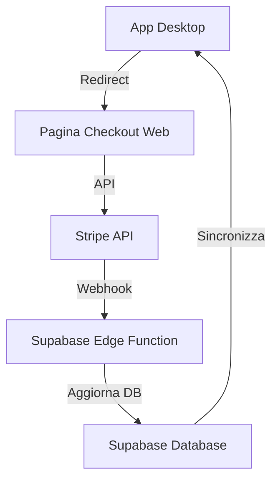

# Integrazione Stripe per Abbonamenti e Token

Questo documento descrive l'architettura e l'implementazione dell'integrazione di Stripe per la gestione di abbonamenti e acquisto token nell'app Racetagger.

## Architettura

L'integrazione con Stripe si svilupperà su tre livelli:

1. **Backend Supabase**: Funzioni edge per gestire pagamenti, webhook e persistenza dati
2. **App Desktop**: Integrazione con il flusso di pagamento web
3. **Frontend Web**: Pagina dedicata per checkout, gestione abbonamenti e acquisto token



## Implementazione

### 1. Setup Stripe

#### 1.1 Account e Configurazione

```bash
# Installa la CLI di Stripe
npm install -g stripe

# Login
stripe login

# Crea prodotti e prezzi in modalità test
stripe products create --name "Piano Base" --description "Pacchetto base con 100 token"
stripe prices create --product=prod_XXX --unit-amount 999 --currency eur --recurring.interval month
```

#### 1.2 Chiavi API

```typescript
// Configurazione sicura
// File: racetagger-app/.env.local (non commitato)
STRIPE_SECRET_KEY=sk_test_XXX
STRIPE_PUBLISHABLE_KEY=pk_test_XXX
STRIPE_WEBHOOK_SECRET=whsec_XXX

// File: racetagger-app/src/lib/stripe/config.ts
export const STRIPE_CONFIG = {
  publishableKey: process.env.STRIPE_PUBLISHABLE_KEY!,
  productsMap: {
    basicSubscription: 'price_XXX',
    proSubscription: 'price_XXX',
    token100: 'price_XXX',
    token500: 'price_XXX'
  }
};
```

### 2. Supabase Edge Functions

#### 2.1 Funzione per Creare una Sessione di Checkout

```typescript
// File: racetagger-app/supabase/functions/stripe-checkout/index.ts
import { serve } from 'https://deno.land/std@0.168.0/http/server.ts';
import { createClient } from 'https://esm.sh/@supabase/supabase-js@2';
import Stripe from 'https://esm.sh/stripe@12.8.0?target=deno';

const stripe = new Stripe(Deno.env.get('STRIPE_SECRET_KEY')!, {
  apiVersion: '2023-10-16',
  httpClient: Stripe.createFetchHttpClient(),
});

serve(async (req) => {
  try {
    const { type, priceId, userId, returnUrl } = await req.json();
    
    // Ottieni dati utente
    const supabase = createClient(
      Deno.env.get('SUPABASE_URL')!,
      Deno.env.get('SUPABASE_SERVICE_ROLE_KEY')!
    );
    
    const { data: user } = await supabase
      .from('auth.users')
      .select('email')
      .eq('id', userId)
      .single();
    
    if (!user) {
      return new Response(
        JSON.stringify({ error: 'User not found' }),
        { status: 404, headers: { 'Content-Type': 'application/json' } }
      );
    }
    
    // Crea una sessione di checkout
    const session = await stripe.checkout.sessions.create({
      payment_method_types: ['card'],
      customer_email: user.email,
      line_items: [
        {
          price: priceId,
          quantity: 1,
        },
      ],
      mode: type === 'subscription' ? 'subscription' : 'payment',
      success_url: `${returnUrl}?success=true&session_id={CHECKOUT_SESSION_ID}`,
      cancel_url: `${returnUrl}?canceled=true`,
      metadata: {
        userId,
        type
      }
    });
    
    return new Response(
      JSON.stringify({ sessionId: session.id, url: session.url }),
      { status: 200, headers: { 'Content-Type': 'application/json' } }
    );
  } catch (error) {
    return new Response(
      JSON.stringify({ error: error.message }),
      { status: 400, headers: { 'Content-Type': 'application/json' } }
    );
  }
});
```

#### 2.2 Webhook per Gestire Eventi di Stripe

```typescript
// File: racetagger-app/supabase/functions/stripe-webhook/index.ts
import { serve } from 'https://deno.land/std@0.168.0/http/server.ts';
import { createClient } from 'https://esm.sh/@supabase/supabase-js@2';
import Stripe from 'https://esm.sh/stripe@12.8.0?target=deno';

const stripe = new Stripe(Deno.env.get('STRIPE_SECRET_KEY')!, {
  apiVersion: '2023-10-16',
  httpClient: Stripe.createFetchHttpClient(),
});

const endpointSecret = Deno.env.get('STRIPE_WEBHOOK_SECRET')!;

serve(async (req) => {
  const signature = req.headers.get('stripe-signature');
  if (!signature) {
    return new Response(
      JSON.stringify({ error: 'Missing stripe-signature header' }),
      { status: 400, headers: { 'Content-Type': 'application/json' } }
    );
  }
  
  const body = await req.text();
  let event;
  
  try {
    event = stripe.webhooks.constructEvent(body, signature, endpointSecret);
  } catch (err) {
    return new Response(
      JSON.stringify({ error: `Webhook signature verification failed: ${err.message}` }),
      { status: 400, headers: { 'Content-Type': 'application/json' } }
    );
  }
  
  const supabase = createClient(
    Deno.env.get('SUPABASE_URL')!,
    Deno.env.get('SUPABASE_SERVICE_ROLE_KEY')!
  );
  
  // Gestione degli eventi di Stripe
  switch (event.type) {
    case 'checkout.session.completed': {
      const session = event.data.object;
      const { userId, type } = session.metadata;
      
      if (type === 'subscription') {
        // Recupera i dettagli dell'abbonamento
        const subscription = await stripe.subscriptions.retrieve(session.subscription);
        const priceId = subscription.items.data[0].price.id;
        
        // Ottieni il piano associato a questo priceId
        const { data: plan } = await supabase
          .from('subscription_plans')
          .select('id, tokens_included')
          .eq('stripe_price_id', priceId)
          .single();
        
        if (!plan) {
          console.error(`No plan found for price ID: ${priceId}`);
          break;
        }
        
        // Aggiungi record di sottoscrizione
        await supabase.from('user_subscriptions').insert({
          user_id: userId,
          plan_id: plan.id,
          stripe_subscription_id: subscription.id,
          is_active: true,
          start_date: new Date(subscription.current_period_start * 1000).toISOString(),
          end_date: new Date(subscription.current_period_end * 1000).toISOString(),
          auto_renew: true
        });
        
        // Aggiungi il numero di token inclusi nel piano
        await supabase.rpc('add_tokens', {
          p_user_id: userId,
          p_token_count: plan.tokens_included,
          p_description: `Tokens from subscription plan: ${plan.id}`
        });
      } 
      else if (type === 'token_purchase') {
        // Ottieni i dettagli del prodotto
        const lineItems = await stripe.checkout.sessions.listLineItems(session.id);
        const priceId = lineItems.data[0].price.id;
        
        // Ottieni la quantità di token associata a questo priceId
        const { data: tokenProduct } = await supabase
          .from('token_products')
          .select('token_count')
          .eq('stripe_price_id', priceId)
          .single();
        
        if (!tokenProduct) {
          console.error(`No token product found for price ID: ${priceId}`);
          break;
        }
        
        // Aggiungi i token all'account dell'utente
        await supabase.rpc('add_tokens', {
          p_user_id: userId,
          p_token_count: tokenProduct.token_count,
          p_description: `Token purchase: ${tokenProduct.token_count} tokens`
        });
      }
      break;
    }
    
    case 'invoice.payment_succeeded': {
      // Gestione rinnovo abbonamento
      const invoice = event.data.object;
      
      if (invoice.subscription) {
        const subscription = await stripe.subscriptions.retrieve(invoice.subscription);
        const customerId = invoice.customer;
        
        // Trova l'utente associato a questo cliente Stripe
        const { data: userLookup } = await supabase
          .from('stripe_customers')
          .select('user_id')
          .eq('customer_id', customerId)
          .single();
        
        if (!userLookup) break;
        
        // Aggiorna la sottoscrizione
        await supabase
          .from('user_subscriptions')
          .update({
            is_active: true,
            start_date: new Date(subscription.current_period_start * 1000).toISOString(),
            end_date: new Date(subscription.current_period_end * 1000).toISOString(),
          })
          .eq('stripe_subscription_id', subscription.id);
        
        // Recupera informazioni sul piano
        const priceId = subscription.items.data[0].price.id;
        const { data: plan } = await supabase
          .from('subscription_plans')
          .select('tokens_included')
          .eq('stripe_price_id', priceId)
          .single();
        
        if (plan) {
          // Aggiungi i token del rinnovo
          await supabase.rpc('add_tokens', {
            p_user_id: userLookup.user_id,
            p_token_count: plan.tokens_included,
            p_description: 'Tokens from subscription renewal'
          });
        }
      }
      break;
    }
    
    case 'customer.subscription.deleted': {
      // Gestione cancellazione abbonamento
      const subscription = event.data.object;
      
      await supabase
        .from('user_subscriptions')
        .update({
          is_active: false,
          auto_renew: false
        })
        .eq('stripe_subscription_id', subscription.id);
      
      break;
    }
  }
  
  return new Response(JSON.stringify({ received: true }), {
    status: 200,
    headers: { 'Content-Type': 'application/json' }
  });
});
```

#### 2.3 Implementare Funzione SQL per Aggiungere Token

```sql
-- File: racetagger-app/supabase/functions/database/add_tokens.sql
CREATE OR REPLACE FUNCTION add_tokens(p_user_id UUID, p_token_count INTEGER, p_description TEXT)
RETURNS BOOLEAN
LANGUAGE plpgsql
SECURITY DEFINER
AS $$
DECLARE
    user_token_record_exists BOOLEAN;
BEGIN
    -- Verifica i parametri
    IF p_user_id IS NULL THEN
        RAISE EXCEPTION 'ID utente non può essere NULL';
        RETURN FALSE;
    END IF;

    IF p_token_count <= 0 THEN
        RAISE EXCEPTION 'Il numero di token deve essere maggiore di zero';
        RETURN FALSE;
    END IF;

    -- Verifica se esiste già un record per l'utente
    SELECT EXISTS(
        SELECT 1 FROM user_tokens WHERE user_id = p_user_id
    ) INTO user_token_record_exists;

    -- Se non esiste, crea un nuovo record
    IF NOT user_token_record_exists THEN
        INSERT INTO user_tokens (user_id, tokens_purchased, tokens_used)
        VALUES (p_user_id, p_token_count, 0);
    ELSE
        -- Altrimenti, aggiorna il record esistente
        UPDATE user_tokens
        SET tokens_purchased = tokens_purchased + p_token_count,
            last_updated = NOW()
        WHERE user_id = p_user_id;
    END IF;

    -- Registra la transazione
    INSERT INTO token_transactions (
        user_id,
        amount,
        transaction_type,
        description
    ) VALUES (
        p_user_id,
        p_token_count,
        'purchase',
        p_description
    );
    
    RETURN TRUE;
EXCEPTION
    WHEN OTHERS THEN
        RAISE EXCEPTION 'Errore durante l''aggiunta dei token: %', SQLERRM;
        RETURN FALSE;
END;
$$;

-- Concedi i permessi per eseguire la funzione
GRANT EXECUTE ON FUNCTION add_tokens(UUID, INTEGER, TEXT) TO service_role;
```

### 3. Implementazione Web Frontend

#### 3.1 Pagina di Checkout

```typescript
// File: racetagger-app/src/app/checkout/page.tsx
import { useEffect, useState } from 'react';
import { useRouter, useSearchParams } from 'next/navigation';
import { loadStripe } from '@stripe/stripe-js';
import { STRIPE_CONFIG } from '@/lib/stripe/config';
import { createClient } from '@/lib/supabase/client';
import SubscriptionPlans from '@/components/SubscriptionPlans';
import TokenPackages from '@/components/TokenPackages';

// Inizializza Stripe
const stripePromise = loadStripe(STRIPE_CONFIG.publishableKey);

export default function CheckoutPage() {
  const router = useRouter();
  const searchParams = useSearchParams();
  const [loading, setLoading] = useState(false);
  const [message, setMessage] = useState('');
  
  // Gestisci il ritorno dal checkout di Stripe
  useEffect(() => {
    if (searchParams.get('success')) {
      setMessage('Pagamento completato con successo! Grazie per il tuo acquisto.');
    }
    
    if (searchParams.get('canceled')) {
      setMessage('Il processo di pagamento è stato annullato.');
    }
  }, [searchParams]);
  
  // Funzione per creare una sessione di checkout
  const createCheckoutSession = async (priceId, type) => {
    setLoading(true);
    
    try {
      const supabase = createClient();
      const { data: { session } } = await supabase.auth.getSession();
      
      if (!session) {
        router.push('/login?redirect=checkout');
        return;
      }
      
      const { data, error } = await supabase.functions.invoke('stripe-checkout', {
        body: {
          priceId,
          type,
          userId: session.user.id,
          returnUrl: window.location.href
        }
      });
      
      if (error) throw error;
      
      // Redirect all'URL di checkout Stripe
      window.location.href = data.url;
    } catch (error) {
      console.error('Error:', error);
      setMessage('Si è verificato un errore durante il processo di checkout. Riprova più tardi.');
    } finally {
      setLoading(false);
    }
  };
  
  return (
    <div className="container mx-auto py-8">
      <h1 className="text-3xl font-bold mb-8">Abbonamenti e Token</h1>
      
      {message && (
        <div className="bg-blue-100 border border-blue-400 text-blue-700 px-4 py-3 rounded mb-6">
          {message}
        </div>
      )}
      
      <div className="grid grid-cols-1 md:grid-cols-2 gap-8">
        <div>
          <h2 className="text-2xl font-semibold mb-4">Abbonamenti</h2>
          <SubscriptionPlans
            onSelectPlan={(priceId) => createCheckoutSession(priceId, 'subscription')}
            loading={loading}
          />
        </div>
        
        <div>
          <h2 className="text-2xl font-semibold mb-4">Pacchetti Token</h2>
          <TokenPackages
            onSelectPackage={(priceId) => createCheckoutSession(priceId, 'token_purchase')}
            loading={loading}
          />
        </div>
      </div>
    </div>
  );
}
```

#### 3.2 Componente Piani di Abbonamento

```typescript
// File: racetagger-app/src/components/SubscriptionPlans.tsx
import { useEffect, useState } from 'react';
import { createClient } from '@/lib/supabase/client';

export default function SubscriptionPlans({ onSelectPlan, loading }) {
  const [plans, setPlans] = useState([]);
  const [currentPlan, setCurrentPlan] = useState(null);
  
  useEffect(() => {
    async function fetchPlans() {
      const supabase = createClient();
      
      // Ottieni i piani disponibili
      const { data: availablePlans } = await supabase
        .from('subscription_plans')
        .select('*')
        .eq('is_active', true)
        .order('monthly_price');
      
      if (availablePlans) {
        setPlans(availablePlans);
      }
      
      // Ottieni il piano attuale dell'utente
      const { data: { session } } = await supabase.auth.getSession();
      if (session) {
        const { data: userSubscription } = await supabase
          .from('user_subscriptions')
          .select(`
            id,
            subscription_plans (
              id,
              name
            )
          `)
          .eq('user_id', session.user.id)
          .eq('is_active', true)
          .single();
        
        if (userSubscription) {
          setCurrentPlan(userSubscription.subscription_plans);
        }
      }
    }
    
    fetchPlans();
  }, []);
  
  return (
    <div className="grid grid-cols-1 md:grid-cols-2 gap-4">
      {plans.map((plan) => (
        <div 
          key={plan.id} 
          className={`border rounded-lg p-6 ${
            currentPlan?.id === plan.id ? 'border-green-500 bg-green-50' : 'border-gray-200'
          }`}
        >
          <div className="flex justify-between items-start">
            <h3 className="text-xl font-semibold">{plan.name}</h3>
            {currentPlan?.id === plan.id && (
              <span className="bg-green-500 text-white text-xs px-2 py-1 rounded-full">Attivo</span>
            )}
          </div>
          
          <div className="mt-4 text-3xl font-bold">
            €{(plan.monthly_price / 100).toFixed(2)}
            <span className="text-sm font-normal text-gray-500">/mese</span>
          </div>
          
          <div className="mt-2 text-lg">
            {plan.tokens_included} token al mese
          </div>
          
          <ul className="mt-4 space-y-2">
            {plan.features && Object.entries(plan.features).map(([key, value]) => (
              <li key={key} className="flex items-start">
                <svg className="h-5 w-5 text-green-500 mr-2" fill="none" stroke="currentColor" viewBox="0 0 24 24">
                  <path strokeLinecap="round" strokeLinejoin="round" strokeWidth="2" d="M5 13l4 4L19 7"></path>
                </svg>
                {value}
              </li>
            ))}
          </ul>
          
          <button
            onClick={() => onSelectPlan(plan.stripe_price_id)}
            disabled={loading || currentPlan?.id === plan.id}
            className={`mt-6 w-full py-2 px-4 rounded ${
              currentPlan?.id === plan.id
                ? 'bg-gray-300 cursor-not-allowed'
                : 'bg-blue-600 hover:bg-blue-700 text-white'
            }`}
          >
            {currentPlan?.id === plan.id ? 'Piano Attuale' : 'Sottoscrivi'}
          </button>
        </div>
      ))}
    </div>
  );
}
```

#### 3.3 Componente Pacchetti Token

```typescript
// File: racetagger-app/src/components/TokenPackages.tsx
import { useEffect, useState } from 'react';
import { createClient } from '@/lib/supabase/client';

export default function TokenPackages({ onSelectPackage, loading }) {
  const [packages, setPackages] = useState([]);
  
  useEffect(() => {
    async function fetchPackages() {
      const supabase = createClient();
      
      const { data } = await supabase
        .from('token_products')
        .select('*')
        .eq('is_active', true)
        .order('token_count');
      
      if (data) {
        setPackages(data);
      }
    }
    
    fetchPackages();
  }, []);
  
  return (
    <div className="grid grid-cols-1 md:grid-cols-2 gap-4">
      {packages.map((pkg) => (
        <div key={pkg.id} className="border border-gray-200 rounded-lg p-6">
          <h3 className="text-xl font-semibold">{pkg.token_count} Token</h3>
          
          <div className="mt-4 text-3xl font-bold">
            €{(pkg.price / 100).toFixed(2)}
          </div>
          
          <div className="mt-2 text-sm text-gray-500">
            {(pkg.price / pkg.token_count / 100).toFixed(2)}€ per token
          </div>
          
          {pkg.is_popular && (
            <div className="mt-2">
              <span className="bg-yellow-400 text-yellow-800 text-xs px-2 py-1 rounded-full">
                Più popolare
              </span>
            </div>
          )}
          
          <div className="mt-4">
            <p>{pkg.description}</p>
          </div>
          
          <button
            onClick={() => onSelectPackage(pkg.stripe_price_id)}
            disabled={loading}
            className="mt-6 w-full py-2 px-4 bg-blue-600 hover:bg-blue-700 text-white rounded"
          >
            {loading ? 'Elaborazione...' : 'Acquista'}
          </button>
        </div>
      ))}
    </div>
  );
}
```

### 4. Integrazione con App Desktop

#### 4.1 AuthService Modificato per Integrare Stripe

```typescript
// File: desktop/src/auth-service.ts (modifiche)
import { shell } from 'electron';
import { SUPABASE_CONFIG } from './config';

// Funzione aggiunta per aprire la pagina di acquisto token
openTokenPurchasePage(): void {
  const tokenPurchaseUrl = `${SUPABASE_CONFIG.url.replace('.supabase.co', '.app')}/checkout`;
  shell.openExternal(tokenPurchaseUrl);
}

// Funzione aggiunta per gestire gli abbonamenti
openSubscriptionManagementPage(): void {
  const subscriptionUrl = `${SUPABASE_CONFIG.url.replace('.supabase.co', '.app')}/account/subscription`;
  shell.openExternal(subscriptionUrl);
}
```

#### 4.2 Aggiungere Gestori nel Main Process

```typescript
// File: desktop/src/main.ts (aggiunta ai gestori IPC)

// Open token purchase page
ipcMain.on('open-token-purchase', () => {
  authService.openTokenPurchasePage();
});

// Open subscription management page
ipcMain.on('open-subscription-management', () => {
  authService.openSubscriptionManagementPage();
});
```

## Schema Database

### Nuove Tabelle da Aggiungere

1. **stripe_customers**
```sql
CREATE TABLE stripe_customers (
    id UUID PRIMARY KEY DEFAULT gen_random_uuid(),
    user_id UUID NOT NULL REFERENCES auth.users(id) ON DELETE CASCADE,
    customer_id TEXT NOT NULL,
    created_at TIMESTAMP WITH TIME ZONE DEFAULT NOW(),
    UNIQUE(user_id),
    UNIQUE(customer_id)
);
```

2. **token_products**
```sql
CREATE TABLE token_products (
    id UUID PRIMARY KEY DEFAULT gen_random_uuid(),
    name TEXT NOT NULL,
    description TEXT,
    token_count INTEGER NOT NULL CHECK (token_count > 0),
    price INTEGER NOT NULL CHECK (price >= 0),
    stripe_price_id TEXT NOT NULL,
    stripe_product_id TEXT NOT NULL,
    is_popular BOOLEAN DEFAULT FALSE,
    is_active BOOLEAN DEFAULT TRUE,
    created_at TIMESTAMP WITH TIME ZONE DEFAULT NOW()
);
```

3. **Aggiungi campi a subscription_plans**
```sql
ALTER TABLE subscription_plans
ADD COLUMN stripe_price_id TEXT,
ADD COLUMN stripe_product_id TEXT,
ADD COLUMN features JSONB DEFAULT '{}'::JSONB;
```

## Configurazione Webhook Stripe

La configurazione del webhook Stripe è un passaggio cruciale:

```bash
# Registrare il webhook in locale durante lo sviluppo
stripe listen --forward-to localhost:54321/functions/v1/stripe-webhook

# Per produzione, registrare l'endpoint nel dashboard Stripe:
# https://dashboard.stripe.com/webhooks
# Endpoint: https://your-project.supabase.co/functions/v1/stripe-webhook
```

## Flusso dell'Utente

1. L'utente fa clic su "Acquista token" o "Gestisci abbonamento" nell'app desktop
2. L'app apre il browser web alla pagina di checkout personalizzata
3. L'utente seleziona un piano o un pacchetto token e completa il pagamento con Stripe
4. Stripe invia un webhook alla funzione edge di Supabase
5. La funzione edge aggiorna le tabelle del database
6. Quando l'utente ritorna all'app desktop, l'app sincronizza i dati con Supabase

## Implementazione Sicura

1. Utilizzare Stripe Checkout anziché Stripe Elements per la conformità PCI
2. Memorizzare i customer ID di Stripe anziché i dettagli di pagamento
3. Utilizzare webhook per garantire che gli aggiornamenti al database avvengano anche in caso di chiusura del browser
4. Configurare RLS per garantire che gli utenti possano vedere solo i propri dati

## Test

1. **Test in ambiente di sviluppo**:
   ```bash
   # Utilizzare eventi di test di Stripe
   stripe trigger checkout.session.completed
   ```

2. **Test di integrazione**:
   - Creare account di test
   - Utilizzare carte di test di Stripe
   - Verificare il flusso completo

## Produzione

Per l'ambiente di produzione, sarà necessario:

1. Creare prodotti e prezzi reali in Stripe
2. Aggiornare le chiavi API a quelle di produzione
3. Configurare i webhook con l'URL di produzione
4. Implementare il monitoraggio per le transazioni fallite
